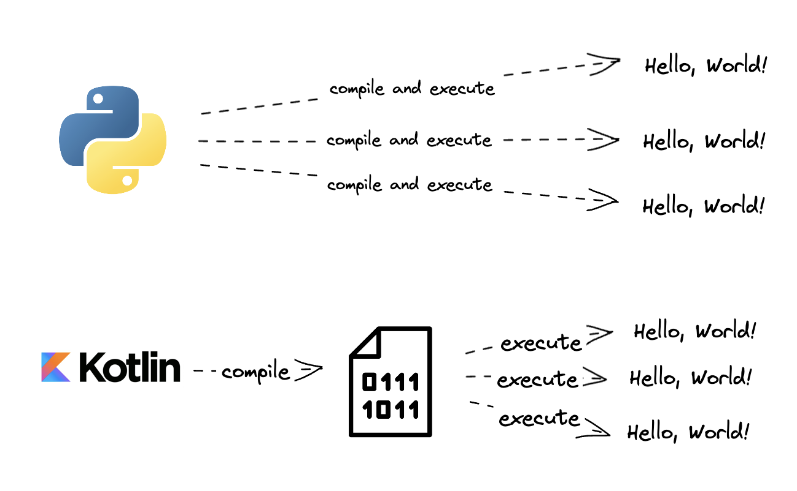

# Your first Kotlin program

_**This is a Makers Bite.** Bites are designed to train specific skills or
tools. They contain an intro, a demonstration video, some exercises with an
example solution video, and a challenge without a solution video for you to test
your learning. [Read more about how to use Makers
Bites.](https://github.com/makersacademy/course/blob/main/labels/bites.md)_

## Objective

Learn to write a "Hello world" program in Kotlin.

## Setting up the project

In IntelliJ, go to File -> New -> Project.

Enter the following options:
 * Name: `hello`
 * Location: you can leave this one to be the default.
 * Language: Kotlin
 * Build system: Gradle (more on this later)
 * JDK: leave the default
 * Gradle DSL: Groovy

Then click "Create" to confirm. It might then take a few moments for IntelliJ to load the project.

## The code

The IDE generated some starter code for us in `Main.kt`.

```kotlin
fun main(args: Array<String>) {

    println("Program arguments: ${args.joinToString()}")
}
```

In Kotlin, the "entrypoint" of a program (which is, the first function being run) is always the `main` function. Let's run it.

## Checking the program output

After running the program, the console should automatically open at the bottom of the editor to display the message printed by `println`.

```
Program arguments: 

Process finished with exit code 0
```


## A note on compilation

Kotlin is often described as a compiled language, which means _all the code_ of your program is converted (compiled) into a lower-level language (that is understood by processors) before anything else happens. After compilation, the code can be repeatedly executed without the need for repeated compilation.

This is different to languages like Python or Ruby, that compile and execute in something more like real-time every time you want to run the code.



> The important thing here is that you know Kotlin compilation and execution are two different steps and that your code will be compiled, in its entirety, before being executed. Later on we'll see how things can go wrong at either point.

## Exercise

We can use the function `println` to print strings or variables in the console output. Add the following to the `main` function:

```kotlin
println("Hello world")
```

Then run the program again to check the output.

## What to do next

You might have noticed some unusual syntax in the signature of the `main` function:

```kotlin
fun main(args: Array<String>) {
    // ...
```

We'll talk about this in the next few sections.


[Next Challenge](02_types.md)

<!-- BEGIN GENERATED SECTION DO NOT EDIT -->

---

**How was this resource?**  
[😫](https://airtable.com/shrUJ3t7KLMqVRFKR?prefill_Repository=makersacademy%2Fkotlin-fundamentals&prefill_File=kotlin_bites%2F01_first_program.md&prefill_Sentiment=😫) [😕](https://airtable.com/shrUJ3t7KLMqVRFKR?prefill_Repository=makersacademy%2Fkotlin-fundamentals&prefill_File=kotlin_bites%2F01_first_program.md&prefill_Sentiment=😕) [😐](https://airtable.com/shrUJ3t7KLMqVRFKR?prefill_Repository=makersacademy%2Fkotlin-fundamentals&prefill_File=kotlin_bites%2F01_first_program.md&prefill_Sentiment=😐) [🙂](https://airtable.com/shrUJ3t7KLMqVRFKR?prefill_Repository=makersacademy%2Fkotlin-fundamentals&prefill_File=kotlin_bites%2F01_first_program.md&prefill_Sentiment=🙂) [😀](https://airtable.com/shrUJ3t7KLMqVRFKR?prefill_Repository=makersacademy%2Fkotlin-fundamentals&prefill_File=kotlin_bites%2F01_first_program.md&prefill_Sentiment=😀)  
Click an emoji to tell us.

<!-- END GENERATED SECTION DO NOT EDIT -->
