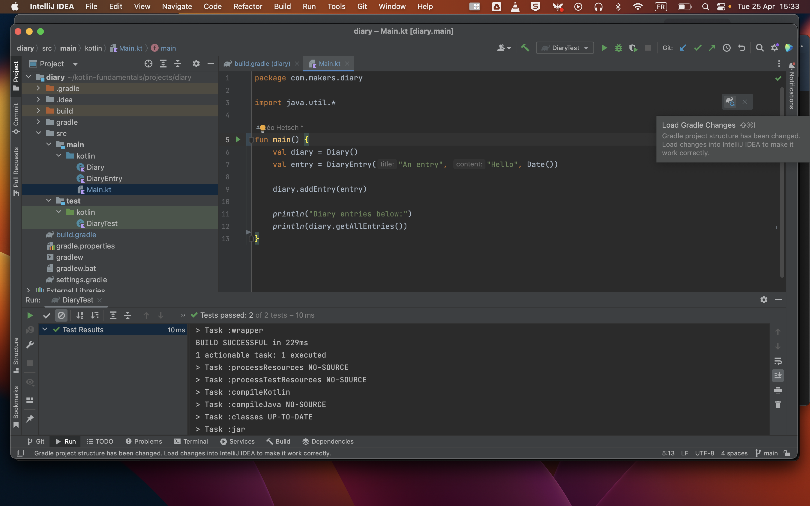

# Using Gradle

_**This is a Makers Bite.** Bites are designed to train specific skills or
tools. They contain an intro, a demonstration video, some exercises with an
example solution video, and a challenge without a solution video for you to test
your learning. [Read more about how to use Makers
Bites.](https://github.com/makersacademy/course/blob/main/labels/bites.md)_

## Objective

Learn to install libraries using the tool Gradle.

## What is Gradle?

[Gradle](https://gradle.org/) is a build tool which can be used to perform a lot of tasks in Kotlin projects, or to install dependencies.

Gradle comes installed with IntelliJ and new projects come with some basic configuration already setup, so you won't need to install and setup Gradle separately.

## Installing a library

Open the file `build.gradle` of the previous `hello` project. It should look more or less like this:

```gradle
plugins {
    id 'org.jetbrains.kotlin.jvm' version '1.8.0'
    id 'application'
}

group = 'org.example'
version = '1.0-SNAPSHOT'

repositories {
    mavenCentral()
}

dependencies {
    testImplementation 'org.jetbrains.kotlin:kotlin-test'
}

test {
    useJUnitPlatform()
}

kotlin {
    jvmToolchain(11)
}

application {
    mainClassName = 'MainKt'
}
```

We'll add a few packages of the library `http4k`, which we can use to build web applications in Kotlin.

```gradle
dependencies {
    // ...

    implementation platform("org.http4k:http4k-bom:4.42.1.0")
    implementation "org.http4k:http4k-core"
    implementation "org.http4k:http4k-server-undertow"
}
```

The IntelliJ IDE will detect you made some changes to the file, and will prompt you to "sync" the project — which means installing the new dependencies, and re-building the project. You can also use the keyboard shortcut `Shift+Cmd+I`



## Using the library `http4k`

Once the Gradle sync is done (and successful), we can use classes, types and functions from the installed libraries in our code:

```kotlin
// file: Main.kt

import org.http4k.core.Request
import org.http4k.core.Response
import org.http4k.core.Status
import org.http4k.server.Undertow
import org.http4k.server.asServer

fun main() {
    val app = { request: Request ->
        Response(Status.OK)
            .body("Hello, ${request.query("name")}!")
    }

    app.asServer(Undertow(9000)).start()
}
```

Running this program will launch a web server at http://localhost:9000.

<!-- BEGIN GENERATED SECTION DO NOT EDIT -->

---

**How was this resource?**  
[😫](https://airtable.com/shrUJ3t7KLMqVRFKR?prefill_Repository=makersacademy%2Fkotlin-fundamentals&prefill_File=kotlin_bites%2F09_using_gradle.md&prefill_Sentiment=😫) [😕](https://airtable.com/shrUJ3t7KLMqVRFKR?prefill_Repository=makersacademy%2Fkotlin-fundamentals&prefill_File=kotlin_bites%2F09_using_gradle.md&prefill_Sentiment=😕) [😐](https://airtable.com/shrUJ3t7KLMqVRFKR?prefill_Repository=makersacademy%2Fkotlin-fundamentals&prefill_File=kotlin_bites%2F09_using_gradle.md&prefill_Sentiment=😐) [🙂](https://airtable.com/shrUJ3t7KLMqVRFKR?prefill_Repository=makersacademy%2Fkotlin-fundamentals&prefill_File=kotlin_bites%2F09_using_gradle.md&prefill_Sentiment=🙂) [😀](https://airtable.com/shrUJ3t7KLMqVRFKR?prefill_Repository=makersacademy%2Fkotlin-fundamentals&prefill_File=kotlin_bites%2F09_using_gradle.md&prefill_Sentiment=😀)  
Click an emoji to tell us.

<!-- END GENERATED SECTION DO NOT EDIT -->
